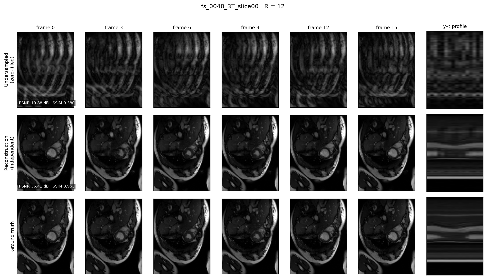
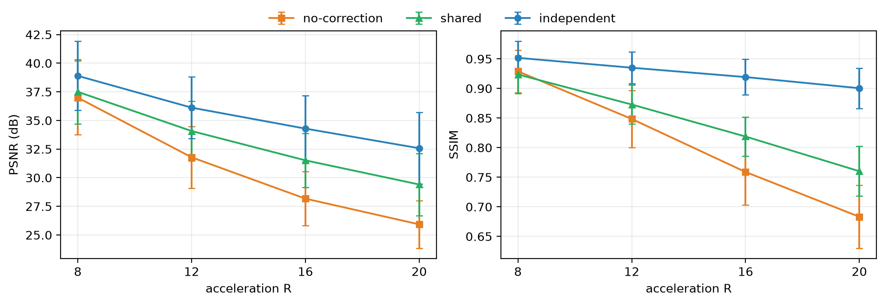

# CardioFlow: Flow Matching for Zero-Shot Cardiac MRI Restoration

CardioFlow reconstructs undersampled dynamic (cine) cardiac MRI **zero-shot**: an
unconditional 3D flow-matching prior is trained once on fully-sampled OCMR cine data, and
at inference time it is steered toward *any* k-t undersampling pattern/acceleration by
alternating **mask fusion** (blending measured k-space into the trajectory) with
**trajectory correction** (a look-ahead + re-noise reset). No paired undersampled/fully-sampled
training data, and no retraining per acceleration rate. This extends
[Restora-Flow](https://github.com/imigraz/Restora-Flow) (Hadzic et al., WACV 2026) from
static pixel-space masks (inpainting/SR/denoising) to k-t space masking for cine MRI.

## Results

Zero-shot reconstruction at R=12 (GRO undersampling), trained prior steered purely at
inference time — no acceleration-specific training:



Trajectory correction is the component that matters: it is worth **+6.6 dB PSNR at R=20**
over no correction. See [zero_shot/README.md](zero_shot/README.md) for the full ablation,
including why the project's original shared-noise hypothesis did not hold up.



## Pipeline

```
raw OCMR .h5  →  preprocessing/preprocess_ocmr.py  →  flow_prior/train.py  →  zero_shot/sampler.py
 (ISMRMRD)        (coil sens, GRO masks, splits)      (unconditional prior)   (zero-shot recon)
```

### 0. Setup

```bash
pip install -r requirements.txt
```

Also requires `ismrmrd-python` and `ismrmrd-python-tools` (not on PyPI — see the install
cells in [eda/example_ocmr.ipynb](eda/example_ocmr.ipynb)), and `sigpy` for coil-sensitivity
estimation.

### 1. Download data (OCMR)

Get the raw ISMRMRD `.h5` files from the [OCMR](https://ocmr.info) S3 bucket, either
individually (see the download cells in
[eda/example_ocmr.ipynb](eda/example_ocmr.ipynb), which use
[`ocmr_data_attributes.csv`](eda/ocmr_data_attributes.csv) + `boto3`) or as the full
archive. Extract so raw files live under a single folder, e.g. `<raw_dir>/ocmr/*.h5`.

### 2. Preprocess

Runs ISMRMRD reading, ESPIRiT coil-sensitivity estimation, and GRO retrospective
undersampling, producing per-slice train/val/test samples:

```bash
cd preprocessing
python preprocess_ocmr.py \
  --raw_dir <raw_dir> --target_dir <processed_dir> \
  --csv_query "smp=='fs'" --accelerations 8 12 16 20 --mask_types gro
```

`run_parallel.sh <raw_dir> <processed_dir> [n_workers]` shards the same job across
several processes. Output: `<processed_dir>/ocmr_train/`, `ocmr_val/`,
`ocmr_test_gro_{8,12,16,20}/`, and cached coil sensitivities under `coil_sens/`.

### 3. Train the flow prior

Unconditional 3D U-Net flow-matching model over `(H, W, T)` cine clips:

```bash
cd flow_prior
python train.py --data_dir <processed_dir> --name prior-v1
```

Every value in [flow_prior/config.yaml](flow_prior/config.yaml) is CLI-settable
(`--set model.num_res_blocks=4`), and `--resume <run_dir>` continues a run. Writes to
`flow_prior/output/<timestamp>_prior-v1/`.

### 4. Zero-shot reconstruction

Loads the frozen prior and reconstructs the held-out undersampled test split — nothing is
trained here:

```bash
cd zero_shot
python sampler.py \
  --checkpoint_dir ../flow_prior/output/<prior-run> --data_dir <processed_dir> \
  --acceleration 12 --name ktflow-v1
```

`evaluate.py` instead runs the full ablation sweep (all accelerations x noise modes) and
`figure.py` renders publication figures from a finished sweep with no GPU required. See
[zero_shot/README.md](zero_shot/README.md) for the algorithm, metrics, and full results.

## Licensing

CC BY-NC 4.0 (see [LICENSE](LICENSE)). Third-party attributions and per-file provenance
are in [CREDITS.md](CREDITS.md).
